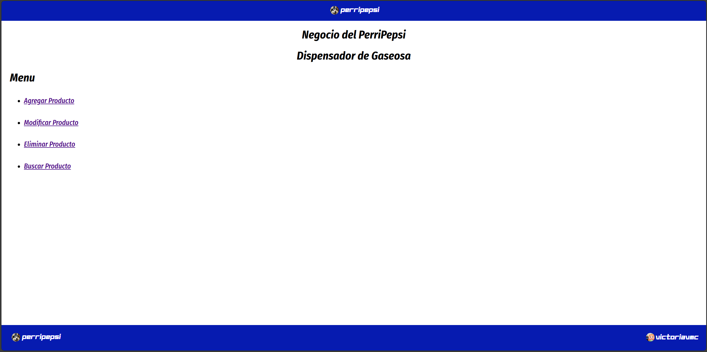

# ABM Simple en PHP y MySQL
Este proyecto es una guía simple para implementar las funciones básicas de un sistema ABM (Agregar, Modificar, Eliminar y Buscar) utilizando PHP y MySQL.
El objetivo es crear un sistema funcional sin diseño visual, enfocado en la funcionalidad. 

## BORRAR LAS LINEAS QUE SEAN DE DISEÑO O QUE NO SE ENCUENTREN EN EL WORD o PDF.
O tambien subi en la carpeta `SinDisenioTalCualElWord` esta como la guia.

## Descripción del Sistema
El sistema trata sobre un "Dispensador de Gaseosa". La base de datos tendrá una tabla llamada `Gaseosas` con los siguientes atributos:
- `Id` (auto incremental)
- `Codigo_de_barras`
- `Marca`
- `Nombre`
- `Precio`

## LEE EL DOCUMENTO WORD O PDF. AHI ESTA LA GUIA DE COMO REALIZAR.

## Aca el final de como quedo el Menu:

